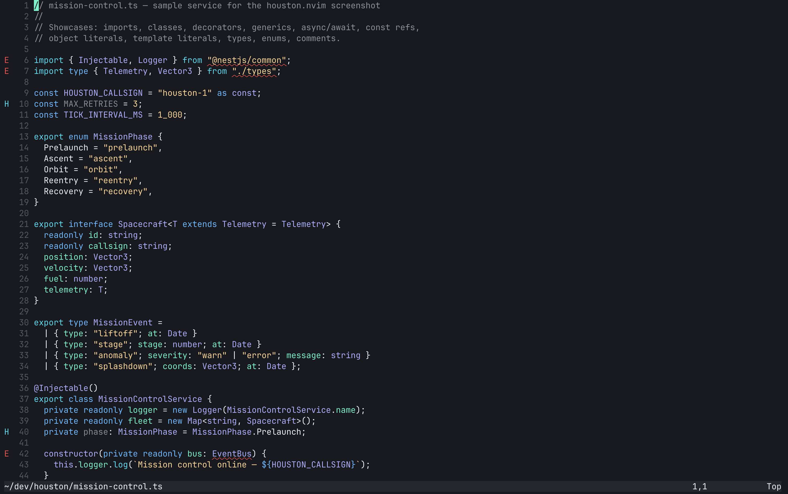
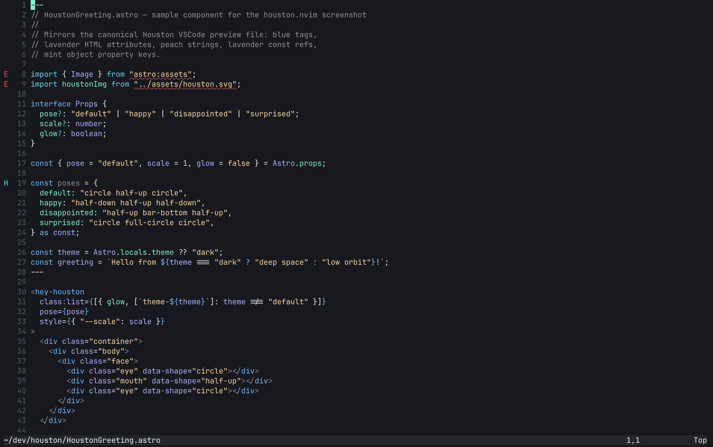
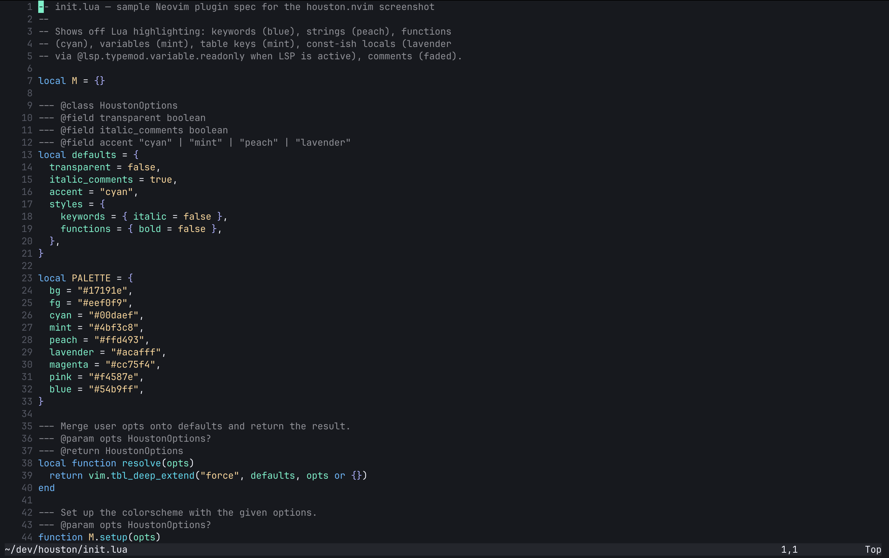
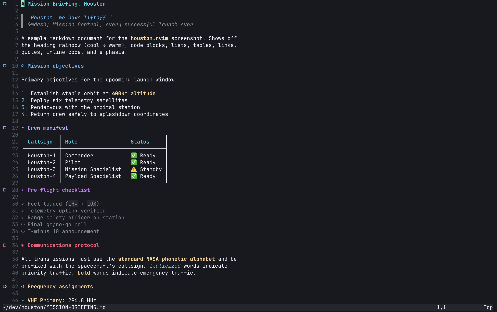

# houston.nvim

[](https://github.com/devbydaniel/houston.nvim/actions/workflows/lint.yml)
[](LICENSE)
[](https://github.com/devbydaniel/houston.nvim/releases)
[](https://neovim.io)

A Neovim port of the [Houston](https://github.com/withastro/houston-vscode)
VSCode theme by [Astro](https://astro.build/).

Pure Lua, no dependencies, faithful translation of the original TextMate
scope mappings, treesitter + LSP semantic tokens, and a bundled lualine
theme. **1138 highlight groups** covering treesitter, LSP, and 25+ popular
plugins out of the box.

## Screenshots

<table>
  <tr>
    <td width="50%"></td>
    <td width="50%"></td>
  </tr>
  <tr>
    <td width="50%"></td>
    <td width="50%"></td>
  </tr>
</table>

## Palette

| Role        | Hex       |
| ----------- | --------- |
| `bg`        | `#17191e` |
| `bg_panel`  | `#23262d` |
| `bg_float`  | `#343841` |
| `fg`        | `#eef0f9` |
| `fg_dim`    | `#bfc1c9` |
| `fg_muted`  | `#858b98` |
| `fg_subtle` | `#545864` |
| `blue`      | `#54b9ff` |
| `cyan`      | `#00daef` |
| `mint`      | `#4bf3c8` |
| `peach`     | `#ffd493` |
| `magenta`   | `#cc75f4` |
| `lavender`  | `#acafff` |
| `red`       | `#f44747` |
| `pink`      | `#f4587e` |

## Requirements

- Neovim ≥ 0.9 (treesitter highlight groups assume the modern `@`-prefixed
  capture names introduced in 0.8/0.9)
- A terminal with true-color support (`termguicolors`)

## Installation

### lazy.nvim

```lua
{
  "devbydaniel/houston.nvim",
  lazy = false,
  priority = 1000,
  config = function()
    require("houston").setup({
      transparent = false,
      italic_comments = true,
    })
    vim.cmd.colorscheme("houston")
  end,
}
```

`setup()` is optional — `:colorscheme houston` works on its own with default
options.

### packer.nvim

```lua
use({
  "devbydaniel/houston.nvim",
  config = function()
    vim.cmd.colorscheme("houston")
  end,
})
```

### vim-plug

```vim
Plug 'devbydaniel/houston.nvim'
" later, after plug#end():
colorscheme houston
```

## Configuration

Defaults:

```lua
require("houston").setup({
  transparent = false,      -- transparent background
  italic_comments = true,   -- italic comments
  terminal_colors = true,   -- set vim.g.terminal_color_*
  styles = {
    keywords  = {},
    functions = {},
    variables = {},
    booleans  = {},
    types     = {},
  },
  -- Mutate the palette before highlights are built
  on_colors = function(colors) end,
  -- Mutate highlight groups before they're applied
  on_highlights = function(highlights, colors) end,
})
```

### Examples

**Override a color globally:**

```lua
require("houston").setup({
  on_colors = function(c)
    c.bg = "#000000"
  end,
})
```

**Override a single highlight group:**

```lua
require("houston").setup({
  on_highlights = function(hl, c)
    hl.Comment = { fg = c.fg_muted, italic = true }
  end,
})
```

## lualine

A lualine theme is bundled:

```lua
require("lualine").setup({
  options = { theme = "houston" },
})
```

## Supported plugins

Foundation:

- **Treesitter** (`@`-prefixed capture groups)
- **LSP** diagnostics, references, inlay hints, and semantic tokens
  (including the `readonly` modifier so JS/TS `const` references render
  in lavender)

**Editor & navigation:**

- [snacks.nvim](https://github.com/folke/snacks.nvim) — picker, notifier,
  input, indent, dim, scratch, zen, dashboard, statuscolumn, winbar, diff
- [telescope.nvim](https://github.com/nvim-telescope/telescope.nvim)
- [nvim-tree.lua](https://github.com/nvim-tree/nvim-tree.lua)
- [neo-tree.nvim](https://github.com/nvim-neo-tree/neo-tree.nvim)
- [bufferline.nvim](https://github.com/akinsho/bufferline.nvim)
- [which-key.nvim](https://github.com/folke/which-key.nvim)
- [indent-blankline.nvim](https://github.com/lukas-reineke/indent-blankline.nvim)
- [leap.nvim](https://github.com/ggandor/leap.nvim)
- [flash.nvim](https://github.com/folke/flash.nvim)
- [mason.nvim](https://github.com/mason-org/mason.nvim)
- [outline.nvim](https://github.com/hedyhli/outline.nvim)
- [aerial.nvim](https://github.com/stevearc/aerial.nvim)
- [yazi.nvim](https://github.com/mikavilpas/yazi.nvim)
- [mini.nvim](https://github.com/echasnovski/mini.nvim) — statusline,
  indentscope, cursorword, files, pick, notify, hipatterns, jump2d, diff

**Completion:**

- [nvim-cmp](https://github.com/hrsh7th/nvim-cmp)
- [blink.cmp](https://github.com/Saghen/blink.cmp)

**LSP & diagnostics:**

- [lspsaga.nvim](https://github.com/nvimdev/lspsaga.nvim)
- [trouble.nvim](https://github.com/folke/trouble.nvim)
- [todo-comments.nvim](https://github.com/folke/todo-comments.nvim)
- [vim-illuminate](https://github.com/RRethy/vim-illuminate)

**Git:**

- [gitsigns.nvim](https://github.com/lewis6991/gitsigns.nvim)
- [diffview.nvim](https://github.com/sindrets/diffview.nvim)
- [vim-fugitive](https://github.com/tpope/vim-fugitive)
- [neogit](https://github.com/NeogitOrg/neogit)

**Markdown:**

- [render-markdown.nvim](https://github.com/MeanderingProgrammer/render-markdown.nvim)
- [headlines.nvim](https://github.com/lukas-reineke/headlines.nvim)
- [obsidian.nvim](https://github.com/epwalsh/obsidian.nvim)

**AI:**

- [copilot.lua](https://github.com/zbirenbaum/copilot.lua) /
  [copilot.vim](https://github.com/github/copilot.vim)
- [codecompanion.nvim](https://github.com/olimorris/codecompanion.nvim)
- [claudecode.nvim](https://github.com/coder/claudecode.nvim)

**Debug:**

- [nvim-dap](https://github.com/mfussenegger/nvim-dap)
- [nvim-dap-ui](https://github.com/rcarriga/nvim-dap-ui)

**UI & misc:**

- [lualine.nvim](https://github.com/nvim-lualine/lualine.nvim) (bundled theme)
- [noice.nvim](https://github.com/folke/noice.nvim)
- [nvim-notify](https://github.com/rcarriga/nvim-notify)
- [toggleterm.nvim](https://github.com/akinsho/toggleterm.nvim)
- [lazy.nvim](https://github.com/folke/lazy.nvim)

Missing one you use? [Open an issue](https://github.com/devbydaniel/houston.nvim/issues/new/choose)
or send a PR — see [CONTRIBUTING.md](./CONTRIBUTING.md).

## Structure

```
houston.nvim/
├── colors/houston.lua            # entry point (`:colorscheme houston`)
├── lua/
│   ├── houston/
│   │   ├── init.lua               # load() + setup()
│   │   ├── config.lua             # defaults + HoustonConfig type
│   │   ├── palette.lua            # raw hex values
│   │   └── groups/
│   │       ├── editor.lua          # core editor groups
│   │       ├── syntax.lua          # legacy vim syntax
│   │       ├── treesitter.lua      # @ capture groups
│   │       ├── lsp.lua             # diagnostics + semantic tokens
│   │       └── plugins.lua         # plugin highlights
│   └── lualine/themes/houston.lua
└── extras/houston-vscode.json    # source theme JSON for reference
```

## Contributing

Issues and PRs welcome. See [CONTRIBUTING.md](./CONTRIBUTING.md) for the
project layout, local dev loop, and the Conventional Commits cheat sheet
(used by [release-please](https://github.com/googleapis/release-please) to
automate the [CHANGELOG](./CHANGELOG.md) and version bumps).

## Credits

- [Astro](https://astro.build/) and [The Astro Technology Company](https://github.com/withastro)
  for the original [Houston VSCode theme](https://github.com/withastro/houston-vscode).
  See [NOTICE](./NOTICE) for the full attribution.
- Structure inspired by
  [tokyonight.nvim](https://github.com/folke/tokyonight.nvim) and
  [catppuccin/nvim](https://github.com/catppuccin/nvim).

## License

[MIT](./LICENSE). The original Houston VSCode theme is also MIT-licensed by
The Astro Technology Company; see [NOTICE](./NOTICE) for details.
